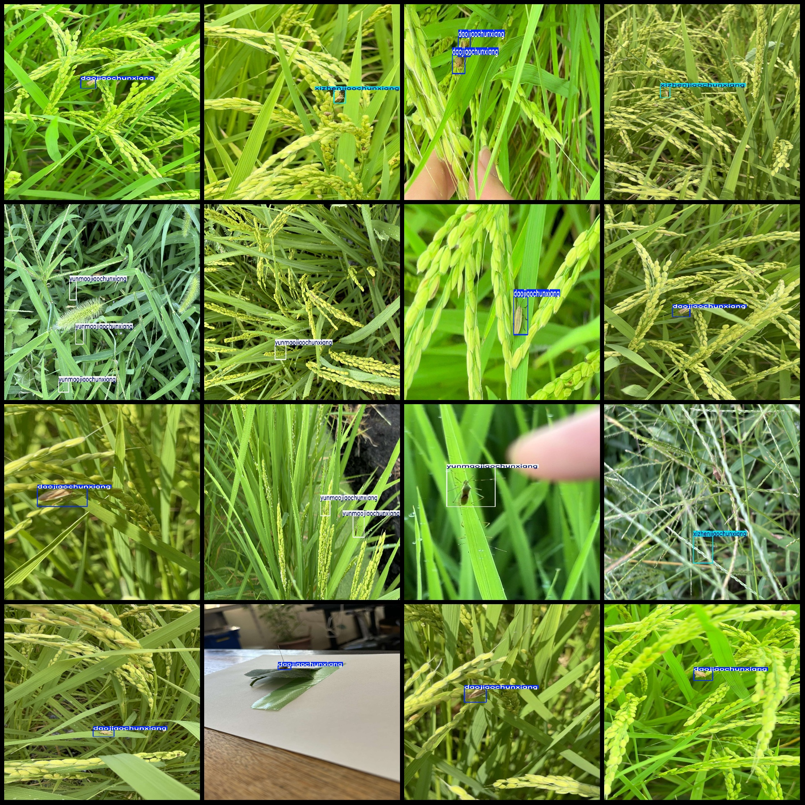
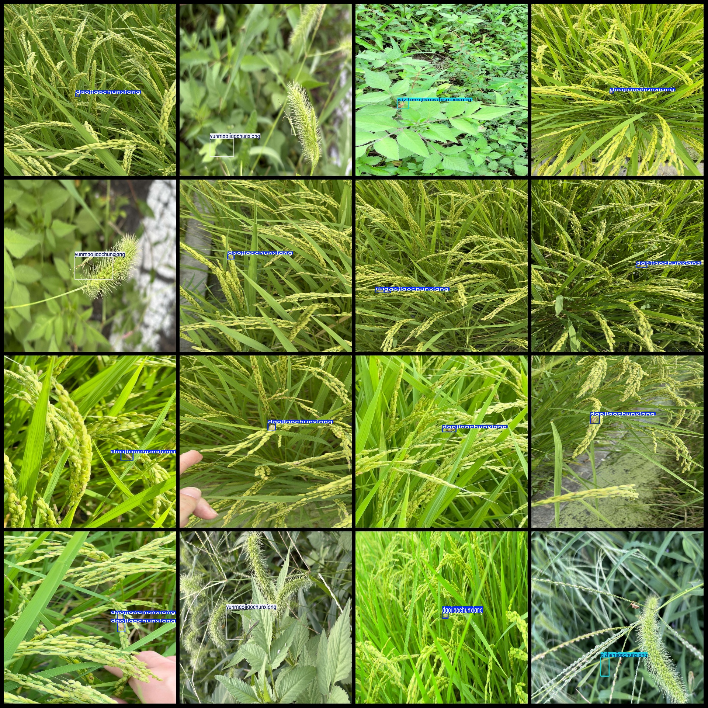

# Agricultural Rice Pests Detection Dataset in VOC+YOLO Format with 5 Categories

Dataset format: Pascal VOC format + YOLO format (txt file without split path, only containing jpg images and corresponding VOC format xml files and yolo format txt files)
Number of images (number of jpg files): 3943
Number of annotations (number of xml files): 3943
Number of annotations (number of txt files): 3943
Number of annotation categories: 5
The corresponding Chinese category names are: ["Red-striped Cicada", "Fine Needle Cicada", "Rice Cicada", "One-stripe Cicada", "Cloud-feathered Cicada"]
The number of boxes annotated per category:
chijinjiaochunxiang box count = 229  
daojiaochunxiang box count = 2810  

Step 1: Identify keywords in the sentence
- box count = 1165

Step 2: Analyze the sentence structure

Step 3: Determine if the sentence is a mathematical equation

Yiwen Jiaochunxiang Frame Number = 65
Rectangles = 546

The area is 273 square units.

$546 \div 2 = 273$ (units)

This means there are 273 rectangles in a square with a side length of 546 units.

Total frames: 4815
Number of images per category:
The number of pictures owned by Chi Jin Jiao Chunxiang is 177.
The number of pictures owned by Daojiaochunxiang is 2400.
The number of images owned by Xizhenjiaochunxiang is 974.
The number of images owned by Yiwenjiaochunxiang is 57.
The number of images owned by Yunmaojiaochunxiang = 449.
Image resolution: Multi-resolution images, such as 1920x3413, 1920x1080, etc.
Use the annotation tool: labelImg
Annotation rule: draw a rectangle box around the class.
Important Note: The dataset does not have a train-validation-test split, you need to do it yourself.
Special Notice: This dataset does not guarantee the accuracy of the trained model or weight file.
Preview of the image:
## Images

Here is a pay link on Stripe ( https://buy.stripe.com/3cs8yP7sY87d0vu9AB ). Please contact me lonlonago@foxmail.com after funding $89, and I will send you a complete data files , thank you!

